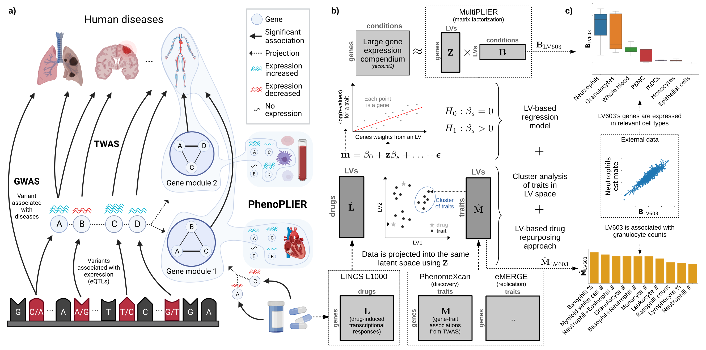

# PhenoPLIER (source code)

<!--
Unit tests are disabled for now
[](https://github.com/greenelab/phenoplier/actions/workflows/pytest.yaml)
-->
[](https://greenelab.github.io/phenoplier_manuscript/)
[](https://greenelab.github.io/phenoplier_manuscript/manuscript.pdf)

## Overview



PhenoPLIER is new computational strategy that integrates statistical associations from GWAS/TWAS with groups of genes (gene modules) that have similar expression patterns across the same cell types.
This allows us to go beyond gene-trait statistical associations and infer the cell types where gene expression regulation is likely to be disrupted, resulting in cell type-specific pathology.

For more details, check out our manuscript in [bioRxiv](https://doi.org/10.1101/2021.07.05.450786) or our [Manubot web version](https://greenelab.github.io/phenoplier_manuscript/).

## Code and data

This repository contains both the *code* (mostly Jupyter notebooks) and the *data* generated by this project.
If you only want to access the code, then you can avoid downloading everything by using this command:
```bash
GIT_LFS_SKIP_SMUDGE=1 git clone git@github.com:greenelab/phenoplier.git
```

If you want to download everything, you can run `git clone` without the `GIT_LFS_SKIP_SMUDGE=1` part.

You can access individual *data* files by going to the [`data/`](data/) folder, selecting the one you are interested in, and downloading them.
You will find all the data matrices mentioned in the manuscript, as well as files to see which genes belong to each latent variable (LV, or gene module) and their weights, or which pathways are associated with each LV, among other files.
If you use any of these files, please carefully follow the [instructions for citations](data/) since this project uses data generated by others.

## Setup

To prepare the environment to run the PhenoPLIER code, follow the steps in
[environment](environment/). This will create a conda environment and download
the necessary data. Alternatively, you can use our Docker image (see below).

## Running code

### From command-line

First, activate your conda environment and export your settings to environmental variables so non-Python scripts can access them:
```bash
conda activate phenoplier
eval `python libs/conf.py`
```

The code to preprocess data and generate results is in the `nbs/` folder. All
notebooks are organized by directories, such as `01_preprocessing`, with file
names that indicate the order in which they should be run (if they share the prefix, then it
means they can be run in parallel). For example, to run
all notebooks for the preprocessing step, you can use this command (requires
[GNU Parallel](https://www.gnu.org/software/parallel/)):

```bash
cd nbs/
parallel -k --lb --halt 2 -j1 'bash run_nbs.sh {}' ::: 01_preprocessing/*.ipynb
```

<!--
Or if you want to run all the analyses at once, you can use:

```bash
shopt -s globstar
parallel -k --lb --halt 2 -j1 'bash run_nbs.sh {}' ::: nbs/{,**/}*.ipynb
```
-->

### From your browser

Alternatively, you can start your JupyterLab server by running:

```bash
bash scripts/run_nbs_server.sh
```

Then, go to `http://localhost:8892`, browse the `nbs` folder, and run the
notebooks in the specified order.

## Using Docker

You can also run all the steps below using a Docker image instead of a local installation.

```bash
docker pull miltondp/phenoplier
```

The image only contains the conda environment with the code in this repository, so after pulling the image you need to download the data as well:

```bash
docker run --rm \
  -v "/tmp/phenoplier_data:/opt/phenoplier_data" \
  miltondp/phenoplier \
  python environment/scripts/setup_data.py
```

The `-v` parameter allows to specify a local directory (`/tmp/phenoplier_data`) where the data will be downloaded.
If you want to generate the figures and tables for the manuscript, you need to clone the [PhenoPLIER manuscript repo](https://github.com/greenelab/phenoplier_manuscript) and pass it with `-v [PATH_TO_MANUSCRIPT_REPO]:/opt/phenoplier_manuscript`.

You can run notebooks from the command line, for example:

```bash
docker run --rm \
  -v "/tmp/phenoplier_data:/opt/phenoplier_data" \
  miltondp/phenoplier \
  /bin/bash -c "parallel -k --lb --halt 2 -j1 'bash nbs/run_nbs.sh {}' ::: nbs/01_preprocessing/*.ipynb"
```

or start a Jupyter Notebook server with:

```bash
docker run --rm \
  -p 8888:8892 \
  -v "/tmp/phenoplier_data:/opt/phenoplier_data" \
  miltondp/phenoplier
```

and access the interface by going to `http://localhost:8888`.
