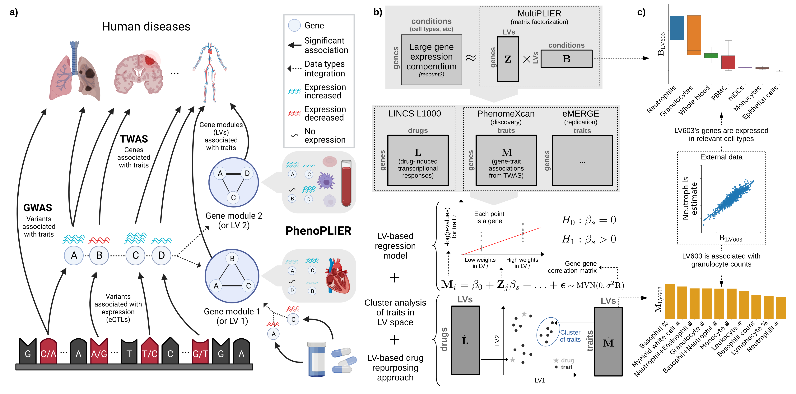

# PhenoPLIER (source code)

[](https://greenelab.github.io/phenoplier_manuscript/)
[](https://greenelab.github.io/phenoplier_manuscript/manuscript.pdf)

## Contents

 * [Overview](#overview)
 * [Quick demo](#quick-demo)
 * [Code and data](#code-and-data)
 * [Setup](#setup)
 * [Running the code](#running-the-code)

## Overview



PhenoPLIER is a flexible computational framework that combines gene-trait and gene-drug associations with gene modules expressed in specific contexts (see Figure above).
The approach uses a latent representation (with latent variables or LVs representing gene modules) derived from a large gene expression compendium to integrate TWAS with drug-induced transcriptional responses for a joint analysis.
The approach consists in three main components:
 1) an LV-based regression model to compute an association between an LV and a trait,
 2) a clustering framework to learn groups of traits with shared transcriptomic properties, and
 3) an LV-based drug repurposing approach that links diseases to potential treatments.

For more details, check out our article in [Nature Communications](https://doi.org/10.1038/s41467-023-41057-4) or our [Manubot web version](https://greenelab.github.io/phenoplier_manuscript/).
To cite PhenoPLIER, see [10.1038/s41467-023-41057-4](https://doi.org/10.1038/s41467-023-41057-4):

> **Projecting genetic associations through gene expression patterns highlights disease etiology and drug mechanisms**<br>
Pividori, M., Lu, S., Li, B. *et al.*<br>
*Nat Commun* **14**, 5562 (2023) <https://doi.org/gspsxr><br>
DOI: [10.1038/s41467-023-41057-4](https://doi.org/10.1038/s41467-023-41057-4)

**Interested in using PhenoPLIER? Any questions?** Check out our [Discussions section](https://github.com/greenelab/phenoplier/discussions) and start a discussion by asking a question or sharing your thoughts. We are happy to help!

## Quick demo

You can follow the instructions in the [`demo/`](nbs/99_demo) folder to run a small demo on real data to quickly see what you can do with PhenoPLIER. 
Depending on your Internet connection, downloading the necessary data for the demo should take less than 5-10 minutes.
Running the demo code should take between 2-5 minutes.

## Code and data

This repository contains both the *code* (mostly Jupyter notebooks) and the *data* generated by this project.
If you only want to access the code, then you can avoid downloading everything by using this command:
```bash
GIT_LFS_SKIP_SMUDGE=1 git clone git@github.com:greenelab/phenoplier.git
```

If you want to download everything, you can run `git clone` without the `GIT_LFS_SKIP_SMUDGE=1` part.

You can access individual *data* files by going to the [`data/`](data/) folder, selecting the one you are interested in, and downloading them.
You will find all the data matrices mentioned in the manuscript, as well as files to see which genes belong to each latent variable (LV, or gene module) and their weights, or which pathways are associated with each LV, among other files.
If you use any of these files, please carefully follow the [instructions for citations](data/) since this project uses data generated by others.

## Setup

### Software requirements

To prepare the environment to run the PhenoPLIER code, follow the steps in [environment](environment/).
This will create a conda environment and download the necessary data.
Depending on your Internet speed, this shouldn't take more than 24 hours.
We tested the code in Ubuntu 20.04+.

**We strongly recommend** using our Docker image (see below), which will greatly simplify running the code and make sure you use the same environment for the analyses.

### Hardware requirements

Most of the code was run with an Intel Core i5 (4 cores) and 64 GB of RAM (32 GB should be enough also).
The null simulations and gene-gene correlation matrices for the GLS model were computed using the [LPC cluster](https://www.med.upenn.edu/dart/computing.html) at the University of Pennsylvania.
The setup will download ~130 GB of input data and software needed.
If you run all the analyses, they will generate ~1100 GB of results files, which includes the null simulations for the GLS model (if you skip this, results would be ~50 GB).
Therefore, you would need to have at least ~1200 GB if you plan to run all the steps.
Running all the steps would take around a week under this hardware configuration (without considering the cluster jobs, which would depend on the resources available).

## Running the code

You basically have two options to run the code: 1) create a local conda environment in your computer, or 2) use our Docker image (where you don't need to create a conda environment).
Using Docker should be much easier, and it is the recommended way.
Below, we first show how to run the code using the command-line (terminal) and your browser.
Then we show how to do the same but with Docker.


### From the command-line

First, activate your conda environment and export your settings to environmental variables so non-Python scripts can access them:
```bash
conda activate phenoplier

# before running the code below, make sure your environment variables
# PHENOPLIER_ROOT_DIR and PHENOPLIER_MANUSCRIPT_DIR point to the right location 
eval `python libs/conf.py`
```

The code to preprocess data and generate results is in the `nbs/` folder. All
notebooks are organized by directories, such as `01_preprocessing`, with file
names that indicate the order in which they should be run (if they share the prefix, then it
means they can be run in parallel). For example, to run
all notebooks for the preprocessing step, you can use this command (requires
[GNU Parallel](https://www.gnu.org/software/parallel/)):

```bash
parallel -k --lb --halt 2 -j1 'bash nbs/run_nbs.sh {}' ::: nbs/01_preprocessing/*.ipynb
```

### From your browser

Alternatively, you can start your JupyterLab server by running:

```bash
bash scripts/run_nbs_server.sh
```

Then, go to [`http://localhost:8892`](http://localhost:8892), browse the `nbs` folder, and run the
notebooks in the specified order.

### Using Docker

You can also run all the steps above using a Docker image instead of a local conda environment.
This means that you **do not need to create a conda environment** nor activate it before using Docker.

First, pull the latest Docker image:

```bash
docker pull miltondp/phenoplier
```

The image only contains the conda environment with the code in this repository, so after pulling the image you need to download the data as well.
First, create a directory in your machine where data will be downloaded/saved:

```bash
# specify a directory in your computer where data will be stored
export DATA_FOLDER="/tmp/phenoplier_data"
mkdir -p ${DATA_FOLDER}
```

Then run the script to download the data:

```bash
docker run --rm \
  -v "${DATA_FOLDER}:/opt/data" \
  --user "$(id -u):$(id -g)" \
  miltondp/phenoplier \
  /bin/bash -c "python environment/scripts/setup_data.py"
```

The `-v` parameter allows to mount a local directory into the container; in this case, it specifies a local directory (`${DATA_FOLDER}` pointing to `/tmp/phenoplier_data`) where the data will be downloaded and results saved.
If you want to generate the figures and tables for the manuscript, you need to clone the [PhenoPLIER manuscript repo](https://github.com/greenelab/phenoplier_manuscript) and pass it with `-v [PATH_TO_MANUSCRIPT_REPO]:/opt/manuscript`.
On the other hand, if you want to pass environment variables like the number of CPU cores to use, you need to use parameter `-e`, such as: `-e PHENOPLIER_N_JOBS=2` for 2 CPU cores.

You can run notebooks from the command line. For example:

```bash
docker run --rm \
  -v "${DATA_FOLDER}:/opt/data" \
  --user "$(id -u):$(id -g)" \
  miltondp/phenoplier \
  /bin/bash -c "parallel -k --lb --halt 2 -j1 'bash nbs/run_nbs.sh {}' ::: nbs/01_preprocessing/*.ipynb"
```

will run all the notebooks to preprocess the input data.
All resulting files will be saved in the folder specified in `${DATA_FOLDER}`.

You can also start a JupyterLab server with:

```bash
docker run --rm \
  -p 8888:8892 \
  -v "${DATA_FOLDER}:/opt/data" \
  --user "$(id -u):$(id -g)" \
  miltondp/phenoplier
```

and access the interface by going to [`http://localhost:8888`](http://localhost:8888).

You might also want to modify the code for your needs.
In that case, you need to clone this repository and mount the directory into the container using `-v "${PATH_TO_THIS_REPO}:/opt/code"`.
The [`demo/`](nbs/99_demo) has instructions to do this as well.
Mounting the code directory will also allow you to see the output of the notebooks after running them.
Otherwise, although you'll be able to access the resulting files under `${DATA_FOLDER}`, you won't see other outputs that are saved inside the notebooks.

Use the [Discussions section](https://github.com/greenelab/phenoplier/discussions) if you have any questions.
